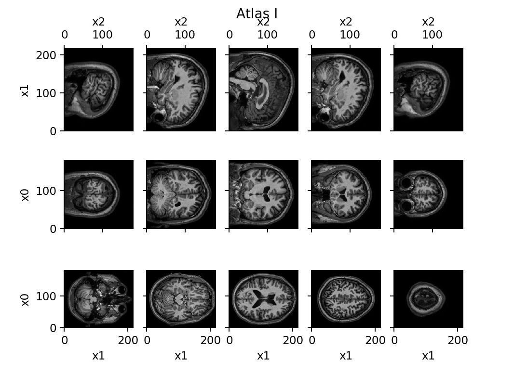
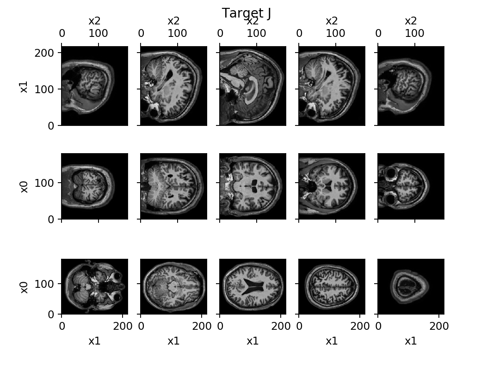
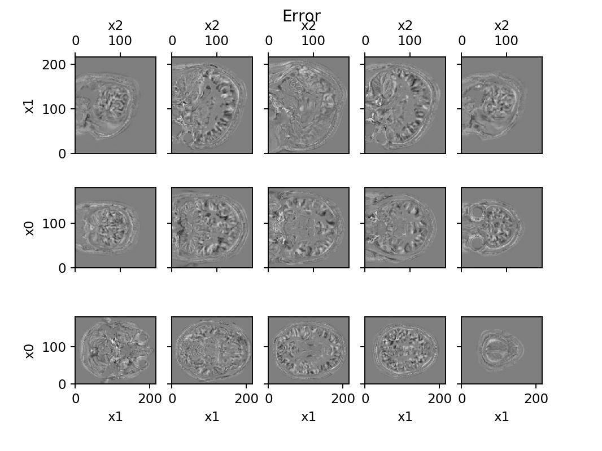

# image_lddmm_tensorflow
## Introduction
Image mapping using the LDDMM algorithm, implemented in tensorflow.  Deformable registration between well characterized atlas images and observed target images allows for labelling of anatomical parcellations for interpretting data, and quantification of atrophy, growth, or shape change.

This package contains functions to run deformable image registration in python, using tensorflow to handle high performance computing issues.

Below shows an illustration of deforming an atlas human MRI to match a target human MRI.  The second row shows the error before and after the alignment.  The decrease in error is particularly noticible in the lateral ventricle.

|Atlas|Target |
|---|---|
|  |  |
|Initial Error|Final Error|
|  |  |

## Examples
Please see Examples.ipynb to see application to human brain and mouse brain.  More examples will be forthcoming.

## To do
1. (coding) Figure out details of running this code on GPU
1. (application) Incorporate more example model organisms, and choose optimal parameters fo reach
1. (algorithms) Incorporate moddern techniques for working with artifacts, missing data, and differences in image contrast

