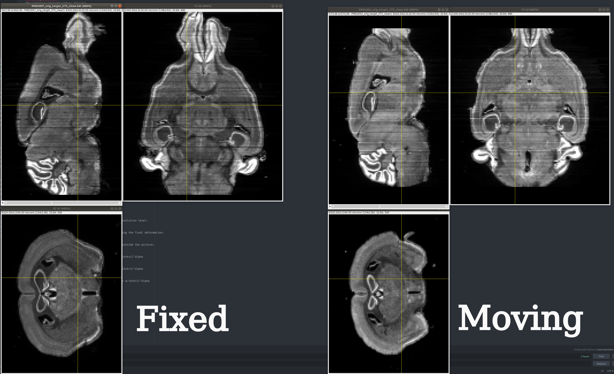
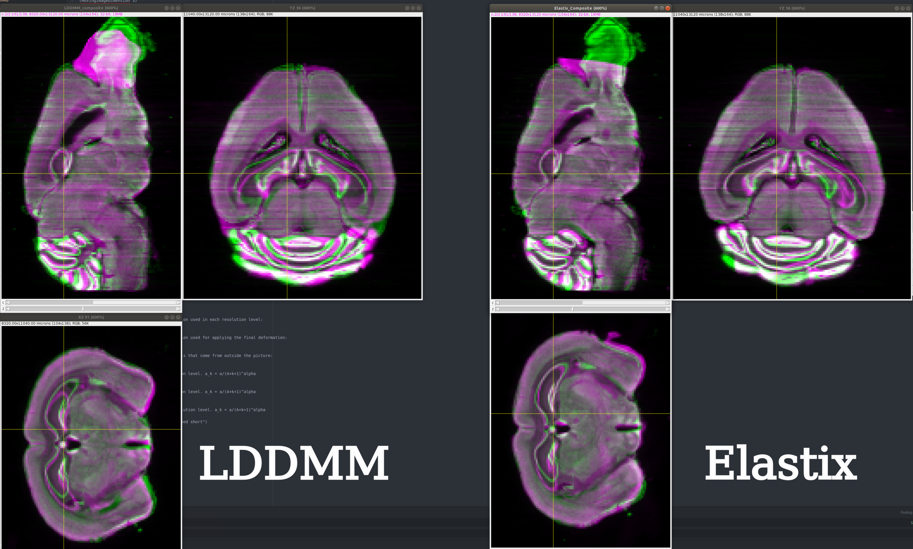
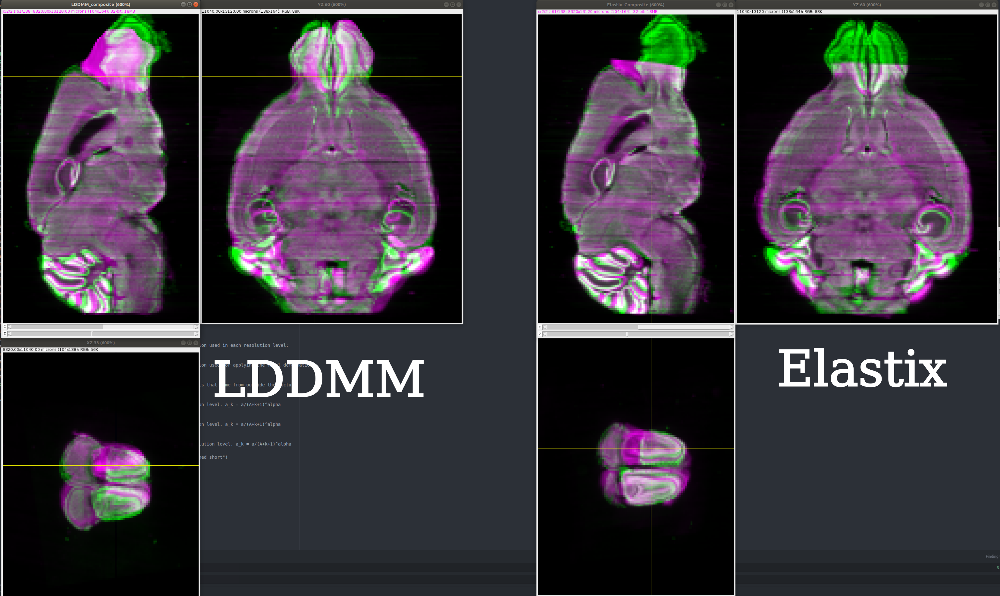
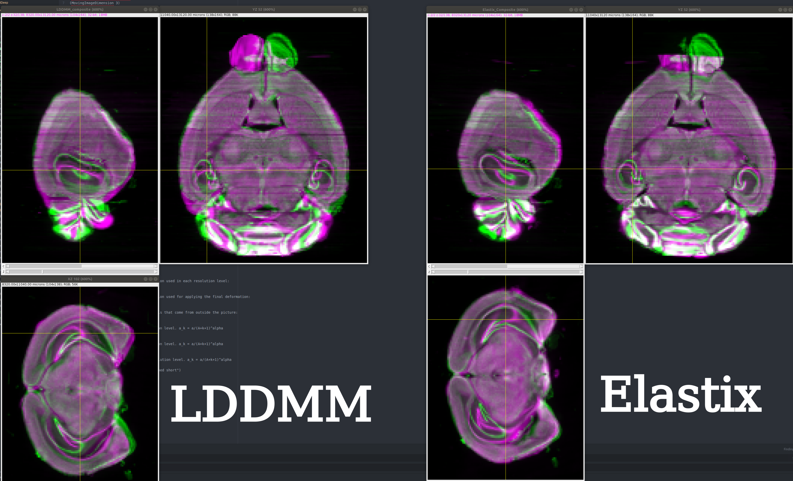

### Quick comparison to Elastix for the Mouse Nissl example

I used 400 iterations, but otherwise default parameters for LDDMM Registration
```python
p = 2
sigmaM = 10.0
eL = 5e-7
eT = 2e-5
eV = 5e-4
naffine = 50
niter = 400
sigmaR = 2e-1
a = (xI[0][1]-xI[0][0])*2
```

Note that I converted the .hdr files to .tiffs. I had some issues with bSpline which
I think was due to the *FinalGridSpacingInVoxels* and *SampleRegionSize* in the
bSpline parameter file. Parameter files are attached.

I used `PMD3097_orig_target_STS_clean.hdr` as the _fixed_ image and `PMD2052_orig_target_STS_clean.hdr` as the _moving_ image.

Interestingly, LDDMM performs really well compared to Elastix, however, Elastix does seem to match smaller structures somewhat better (see hippocampus) and does not artificially extend the olfactory bulb. Despite this, LDDMM looks promising, and I am sure the author could adjust the parameters so as to make the
registration work better. 








